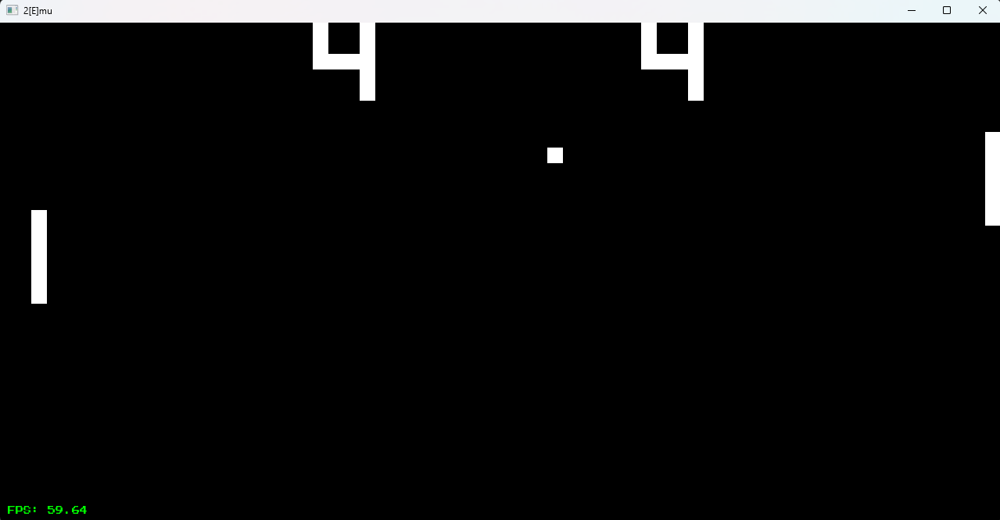
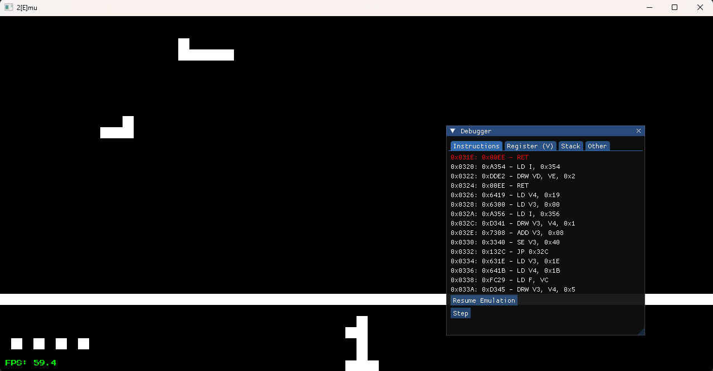

# 2[E]mu, a CHIP-8 Interpreter & Integrated ImGui Debugger

A high-performance **CHIP-8 Virtual Machine** implemented in **Modern C++20**. This project focuses on cycle-accurate emulation and provides a robust real-time debugging suite for low-level software analysis.



## 🏛️ System Architecture

This emulator implements the standard CHIP-8 specifications with a focus on **Systems Programming** best practices:

* **CPU:** 500Hz instruction clock with a decoupled 60Hz Timer/UI frequency.
* **Memory Map:** 4096 bytes of linear addressing (ROM entry point at `0x200`).
* **Registers:** 16 x 8-bit general-purpose registers ($V0$ - $VF$).
* **Program Counter ($PC$):** 16-bit pointer with custom **Offset Logic** for real-time synchronization with the disassembler view.
* **Stack:** 16-level nested subroutine support.
* **Display:** 64x32 monochrome buffer using **XOR Rendering Logic** for hardware-level collision detection ($VF$ flag).

## 🛠️ Advanced Debugger Features

Integrated via **Dear ImGui**, the debugger provides a professional-grade environment for ROM analysis:

### 1. Real-time Disassembler
* **Instruction Synchronization:** Implements a $PC - 2$ offset to align the currently executing opcode with the visual mnemonic highlight.
* **Wait State Awareness:** Visual indicator for the `FX0A` instruction (**WAITING FOR KEY**) to prevent UI confusion during blocking input cycles.

### 2. Execution Control (Control Flow)
* **Deterministic Pause:** Freezes both the CPU cycles and the Delay/Sound timers while keeping the UI responsive.
* **Single-Step Execution:** Execute exactly one opcode at a time while the system is paused to inspect state transitions in registers and memory.

### 3. State Visualization
* **Register Tables:** Organized hex/decimal view of all $Vx$ registers.
* **Context Tabs:** Separated views for **Instructions**, **Registers**, **Stack**, and **System State** (I, PC, SP, Timers).

## 🚀 Performance & Timing

The main loop utilizes a **Fixed-Timestep** algorithm via `<chrono>`:
* **Cycle Accumulator:** Ensures the CPU maintains exactly 500 instructions per second regardless of host hardware speed.
* **Input Debouncing:** SFML events are processed independently to ensure responsive keyboard mapping even during high-frequency cycles.

## ⌨️ Key Mapping (Hexpad)

| CHIP-8 | PC Key | | CHIP-8 | PC Key |
| :--- | :--- | :--- | :--- | :--- |
| **1** | `1` | | **2** | `2` |
| **3** | `3` | | **C** | `4` |
| **4** | `Q` | | **5** | `W` |
| **6** | `E` | | **D** | `R` |
| **7** | `A` | | **8** | `S` |
| **9** | `9` | | **E** | `F` |
| **A** | `Z` | | **0** | `X` |
| **B** | `C` | | **F** | `V` |

* **F1:** System Reload (Hard Reset).
* **ESC:** Toggles the ImGui Main Menu Bar (ROM selection and Debugger settings).
* **Debugger:** Integrated "Pause" and "Step" buttons.

## 🏗️ Building the Project

### Prerequisites
* C++20 compliant compiler (GCC 11+, Clang 13+, or MSVC 2022).
* **SFML 3.0+**
* **Dear ImGui** (Included via FetchContent/Submodule)

### Build Commands
```bash
cmake -B build
cmake --build build
```

## 📸 Media & Demos

### Main Interface
![2[E]mu Main Screen](assets/main_screen.png)

### Integrated Debugger in Action


## ✍️ Author's Note

What can I say? This was a really fun project to make. I am currently a first-semester Computer Science student at **UFERSA (Campus Mossoró)**. My trajectory until now was deciding that I want to be a graphics programmer, so after that I started learning C++ from [learncpp.com](https://www.learncpp.com/) (C++ is not my first language) and got a solid base to work on. 

Nonetheless, there is more to learn. I began this project because I wanted to build something; I was really anxious to do that. It was fun to apply bitwise operations, break my head thinking how to use the graphics library SFML, create a debugger via Dear ImGui and code C++ in general.

From now on, I want to learn more about C++ so that I can learn my first graphics API, **OpenGL**, and begin my next project. I really am excited for this. Last, but no less important, I wanted to thank my friend **Kailany** for doing this simple pixel art for the rom selection screen. I didn't want to bother her, so I asked for something real simple.

## 📚 Credits & References

* **Cowgod's CHIP-8 Technical Reference:** Primary technical guide for opcode logic and memory mapping.
* **Mastering CHIP-8:** Essential reference for timer frequencies and advanced instruction nuances.
* **Artwork:** Special thanks to **Kailany** for the custom pixel art branding.
* **Educational Foundation:** Appreciation to the community at [LearnCPP.com](https://www.learncpp.com/) for the C++ fundamentals.

---
Developed as a foundational step toward Graphics Programming by a Computer Science student at **UFERSA**.